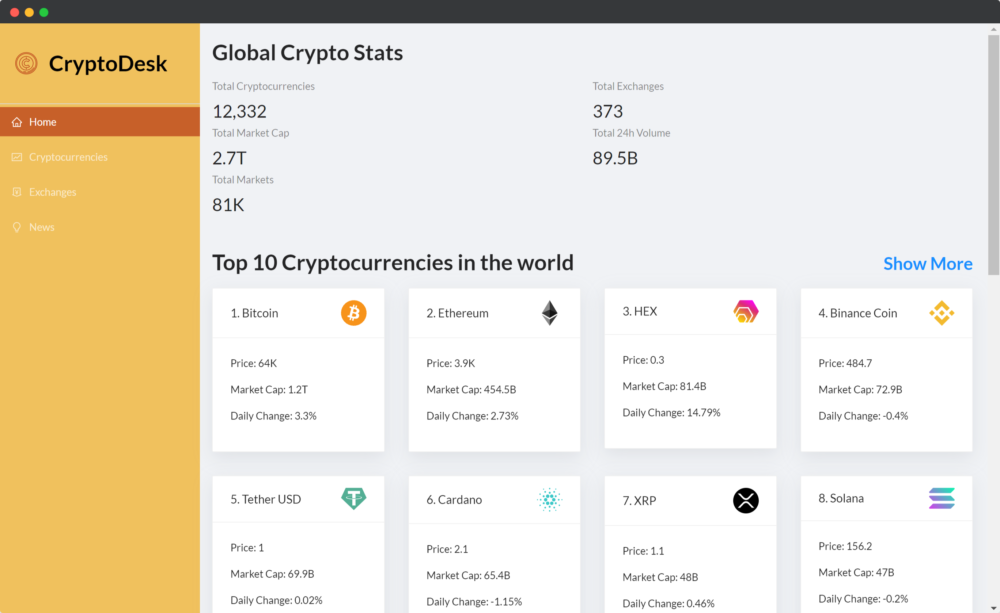
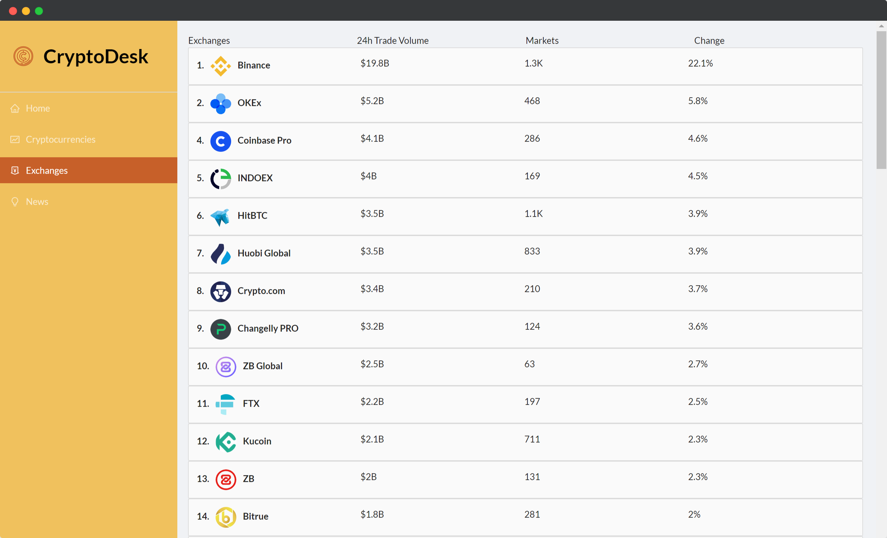
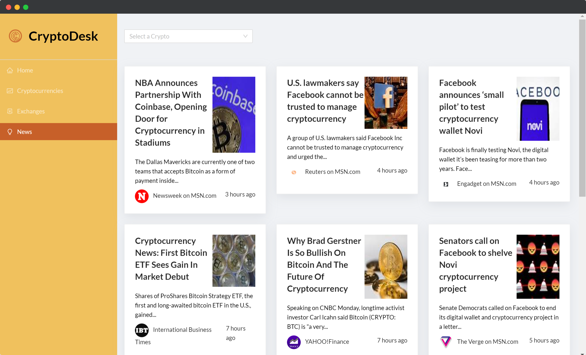

<div id="top"></div>

[![github-follow][github-follow]][github-url]
[![demo][demo-badge]][demo]
[![website][github-pages]][github-pages-url]
[![Issues][issues-shield]][issues-url]
[![MIT License][license-shield]][license-url]
[![LinkedIn][linkedin-shield]][linkedin-url]


<!-- PROJECT LOGO -->
<br />
<div align="center">
  <a href="https://github.com/johansonfelix/crypto-desk">
    
  </a>

  <h1 align="center">CryptoDesk</h1>

  <p align="center">
    CryptoDesk is a one-stop information site for all things Cryptocurrency built in React.js with graphing done with Chart.js
    <br /> 
    <a href="https://github.com/johansonfelix/tripvisor/blob/main/README.md"><strong>Explore the docs »</strong></a>
    <br />
    <br />
    <a href="https://tripvisorapp.netlify.app/">View Demo</a>
    ·
    <a href="https://github.com/johansonfelix/tripvisor/issues">Report Bug</a>
    ·
    <a href="https://github.com/johansonfelix/tripvisor/issues">Request Feature</a>
  </p>
</div>


<!-- TABLE OF CONTENTS -->
<details>
  <summary>Table of Contents</summary>
  <ol>
    <li>
      <a href="#about-the-project">About The Project</a>
      <ul>
        <li><a href="#built-with">Built With</a></li>
      </ul>
    </li>
    <li>
      <a href="#getting-started">Getting Started</a>
      <ul>
        <li><a href="#prerequisites">Prerequisites</a></li>
        <li><a href="#installation">Installation</a></li>
      </ul>
    </li>
    <li><a href="#usage">Usage</a></li>
    <li><a href="#roadmap">Roadmap</a></li>
    <li><a href="#contributing">Contributing</a></li>
    <li><a href="#license">License</a></li>
    <li><a href="#contact">Contact</a></li>
    <li><a href="#acknowledgments">Acknowledgments</a></li>
  </ol>
</details>


<!-- ABOUT THE PROJECT -->
## About The Project

[![Product Name Screen Shot][product-screenshot]](https://crypto-desk.netlify.app/)
CryptoDesk is a one-stop information site for all things Cryptocurrency built in React.js with graphing done with Chart.js. The application
details stats and market trends of the top 100 Cryptocurrencies in the world for users interested in Crypto trading. CryptoDesk also
provides current Crypto News from several news sources for crypto enthusiasts. Data used in the application is fetched using reliable
public external APIs.

<p align="right">(<a href="#top">back to top</a>)</p>

</p>


<!-- GETTING STARTED -->
## Getting Started

To setup the application on your local environment: 


### Installation

1. Clone the repo
   ```sh
   git clone https://github.com/johansonfelix/crypto-desk.git
   ```
2. Install dependencies
     ```sh
    yarn install
   ```

4. Start react
 ```sh
    yarn start
   ```
5. Test application on localhost:3000

<p align="right">(<a href="#top">back to top</a>)</p>


<!-- USAGE EXAMPLES -->
## Usage






<p align="right">(<a href="#top">back to top</a>)</p>


<p align="right">(<a href="#top">back to top</a>)</p>


<!-- CONTRIBUTING -->
## Contributing

Contributions are what make the open source community such an amazing place to learn, inspire, and create.

If you have a suggestion that would make this better, please fork the repo and create a pull request. You can also simply open an issue with the tag "enhancement".
Don't forget to give the project a star! **Thanks again!**

1. Fork the Project
2. Create your Feature Branch (`git checkout -b feature/AmazingFeature`)
3. Commit your Changes (`git commit -m 'Add some AmazingFeature'`)
4. Push to the Branch (`git push origin feature/AmazingFeature`)
5. Open a Pull Request

<p align="right">(<a href="#top">back to top</a>)</p>


<!-- LICENSE -->
## License

Distributed under the MIT License. See `LICENSE.txt` for more information.

<p align="right">(<a href="#top">back to top</a>)</p>


<!-- CONTACT -->
## Contact

* [Johanson Felix](johansonfelix.github.io) - (felix.johanson@gmail.com) 
* [LinkedIn][license-url]</br>
* Project Link: [https://github.com/johansonfelix/crypto-desk.git](https://github.com/johansonfelix/crypto-desk.git)

<p align="right">(<a href="#top">back to top</a>)</p>


<p align="right">(<a href="#top">back to top</a>)</p>


<!-- MARKDOWN LINKS & IMAGES -->
[github-follow]:https://img.shields.io/badge/Follow-black.svg?style=for-the-badge&logo=github&color=555
[github-url]:https://github.com/johansonfelix
[github-pages]:https://img.shields.io/badge/-johansonfelix-red.svg?style=for-the-badge&color=red
[github-pages-url]:https://johansonfelix.github.io
[issues-shield]: https://img.shields.io/github/issues/othneildrew/Best-README-Template.svg?style=for-the-badge
[issues-url]: https://github.com/johansonfelix/crypto-desk/issues
[license-shield]: https://img.shields.io/github/license/othneildrew/Best-README-Template.svg?style=for-the-badge
[license-url]: https://github.com/johansonfelix/crypto-desk/LICENSE.txt
[linkedin-shield]: https://img.shields.io/badge/-LinkedIn-black.svg?style=for-the-badge&logo=linkedin&colorB=555
[linkedin-url]:https://www.linkedin.com/in/johanson-felix-336a94186/
[product-screenshot]: images/screely-1634691057452.png
[demo]:https://crypto-desk.netlify.app/
[demo-badge]:https://img.shields.io/badge/-demo-green.svg?style=for-the-badge&color=green
